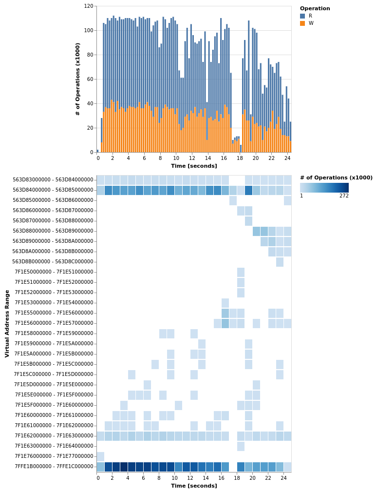

# MemStat

This is a small demo of *MemStat*, a *Pintool* I wrote to analyse the memory usage behaviour of executables.  Pintool is
the term for tools written for [Intel Pin, a dynamic binary instrumentation
tool](https://software.intel.com/en-us/articles/pin-a-dynamic-binary-instrumentation-tool).

## Licence

MemStat - A Pintool to analyse the memory access behaviour of executables

Copyright (C) 2019  Immanuel Haffner

This program is free software: you can redistribute it and/or modify
it under the terms of the GNU General Public License as published by
the Free Software Foundation, either version 3 of the License, or
(at your option) any later version.

This program is distributed in the hope that it will be useful,
but WITHOUT ANY WARRANTY; without even the implied warranty of
MERCHANTABILITY or FITNESS FOR A PARTICULAR PURPOSE.  See the
GNU General Public License for more details.

You should have received a copy of the GNU General Public License
along with this program.  If not, see <http://www.gnu.org/licenses/>.

## Examples

Below I show two examples of the information gathered with MemStat.  The first demo is a small DBMS project that our
students have to implement in our core lecture "Database Systems".  (Here I have used my reference implementation.)  The
second example is [Intel Embree, a collection of high-performance ray tracing kernels](https://www.embree.org/).  In
particular, I used Embree's path tracer to render the *Crown of Austria* model.

### The DBMS Project

Profile the DBMS indexing benchmark with MemStat:

```
$ ~/Documents/pin/pin \
    -t ~/Documents/pin/source/tools/MemStat/obj-intel64/MemStat.so -- \
        build_release/bin/benchmark_indices 1000000 \
            resource/lineitem_1kk.tbl resource/orders.tbl 3 43
```

#### Different Granularities and their Performance and Footprint

Without instrumentation the application runs *2 seconds*.

| **NTH_SAMPLE** | **TIME [sec]** | **SIZE [MiB]** |
|-----------|------------|------------|
| 100000 | 21.644 | |
| 10000 | 20.968 | |
| 5000 | 21.303 | |
| 1000 | 22.184 | |
| 500 | 23.179 | 70 |
| 400 | 26.031 | |
| 300 | 25.007 | |
| 200 | 26.504 | |
| 100 | 34.469 | |


#### Visualization of Profiling Results




### Embree Path Tracer

Profile the Intel Embree Path Tracer rendering the Crown of Austria model:

```
~/Documents/pin/pin -t ~/Documents/pin/source/tools/MemStat/obj-intel64/MemStat.so -- \
    build_release/pathtracer --threads 1 -c crown/crown.ecs -o crown/crown.jpg
```

Running time w/o instrumentation is *4.240 seconds*; with instrumentation *42.576 seconds*.

### Visualization of Profiling Results


## Live Demo

Included in this repository is a [Jupyter Notebook](MemStat.ipynb) where the gathered profiling data is visualized with
[Altair](https://altair-viz.github.io/).  The visualizations are interactive, you can select regions to zoom in to get
more fine granular visualizations.

To run the demo you will need the profiling data, that is available on my Google Drive:
[dbms.bin](https://drive.google.com/file/d/1FPk2H-9-7cGUYt2EOAC3xS6Naeng5NSG/view?usp=sharing) and
[embree.bin](https://drive.google.com/file/d/15KwCdCG3n9JawLqf6BHGe6bGQtAYjrps/view?usp=sharing)

## Code Availability

Currently the code of the MemStat Pintool is closed source, sorry.  The licence applies to the code provided in this
repository, i.e. the Jupyter Notebook.
