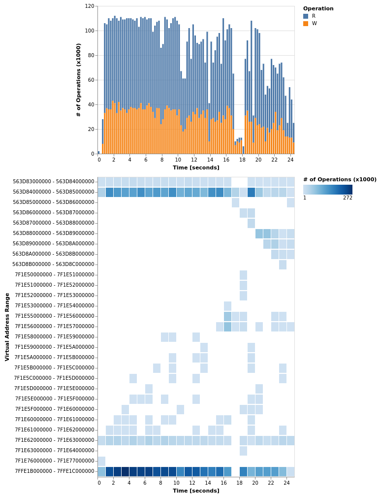
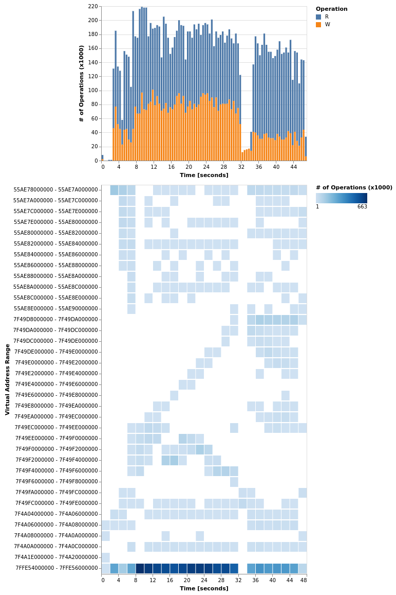

# DBMS Project

```
$ ~/Documents/pin/pin \
    -t ~/Documents/pin/source/tools/MemStat/obj-intel64/MemStat.so -- \
        build_release/bin/benchmark_indices 1000000 \
            resource/lineitem_1kk.tbl resource/orders.tbl 3 43
```

### Different Granularities and their Performance and Footprint

Without instrumentation the application runs *2 seconds*.

| **NTH_SAMPLE** | **TIME [sec]** | **SIZE [MiB]** |
|-----------|------------|------------|
| 100000 | 21.644 | |
| 10000 | 20.968 | |
| 5000 | 21.303 | |
| 1000 | 22.184 | |
| 500 | 23.179 | 70 |
| 400 | 26.031 | |
| 300 | 25.007 | |
| 200 | 26.504 | |
| 100 | 34.469 | |


### Visualization of Profiling Results

</img>


# Embree

## Path Tracer

```
~/Documents/pin/pin -t ~/Documents/pin/source/tools/MemStat/obj-intel64/MemStat.so -- \
    build_release/pathtracer --threads 1 -c crown/crown.ecs -o crown/crown.jpg
```

Running time w/o instrumentation is *4.240 seconds*.  With instrumentation *42.576 seconds*.

### Visualization of Profiling Results

</img>
